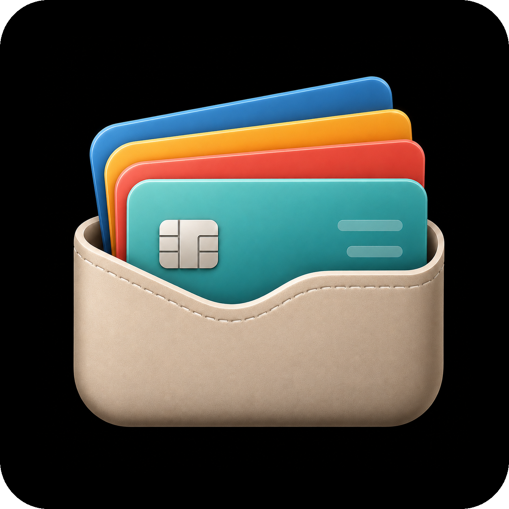

<p align="center">
  
</p>

<h1 align="center">Oh My Cards</h1>

<p align="center">
  A private, local-first credit card organizer for rewards, benefits, billing, and smarter card choices.
</p>

<p align="center">
  <a href="https://chenfangfc.github.io/Oh_My_Cards/">
    
  </a>
</p>

<p align="center">
  
  
  
</p>

<p align="center">
  <a href="https://chenfangfc.github.io/Oh_My_Cards/">
    
  </a>
</p>

## What It Does

| Organize                                                                                         | Decide                                                                               | Track                                                                                               |
| ------------------------------------------------------------------------------------------------ | ------------------------------------------------------------------------------------ | --------------------------------------------------------------------------------------------------- |
| Build a wallet and browse a card library with images, banks, fees, benefits, and official links. | Get card suggestions for purchases using wallet cards and card-library reward rules. | Log purchases, payments, benefits, due amounts, available credit, rewards, and annual fee progress. |

## Privacy

Oh My Cards stores wallet cards, transactions, billing settings, and benefit usage on the user's device through browser storage such as localStorage and IndexedDB. It does not upload personal wallet data to a cloud database.

Use **Export Data** and **Import Data** when moving between devices or browsers.

## Development

```bash
corepack pnpm install
COREPACK_ENABLE_AUTO_PIN=0 PORT=19957 BASE_PATH=/ corepack pnpm --dir artifacts/card-organizer dev
```

<details>
<summary>More commands</summary>

```bash
# Build locally
COREPACK_ENABLE_AUTO_PIN=0 PORT=19957 BASE_PATH=/ corepack pnpm --dir artifacts/card-organizer build

# Build for GitHub Pages
COREPACK_ENABLE_AUTO_PIN=0 PORT=19957 BASE_PATH=/Oh_My_Cards/ corepack pnpm --dir artifacts/card-organizer build

# Typecheck
COREPACK_ENABLE_AUTO_PIN=0 corepack pnpm run typecheck
```

</details>

## Contributing

Contributions are welcome, especially card rule corrections, official-source updates, cleaner card images, UI/accessibility improvements, bug reports, and mobile app ideas.
